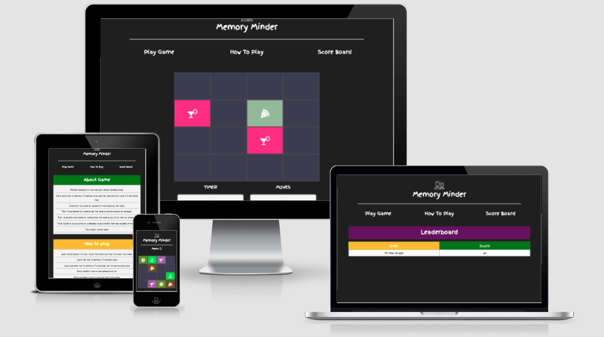
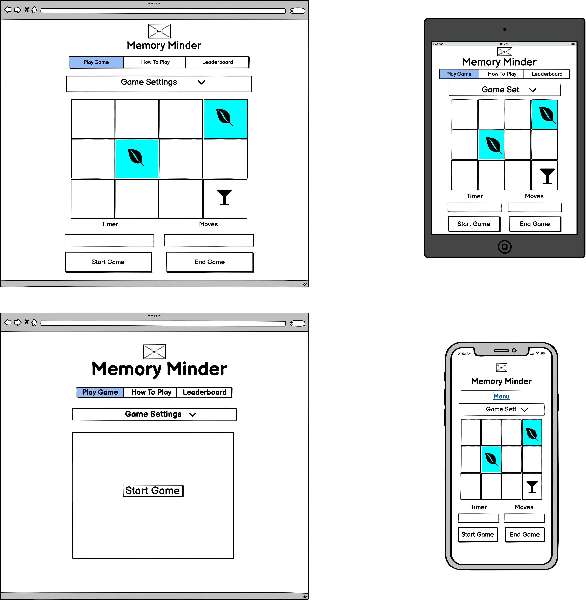
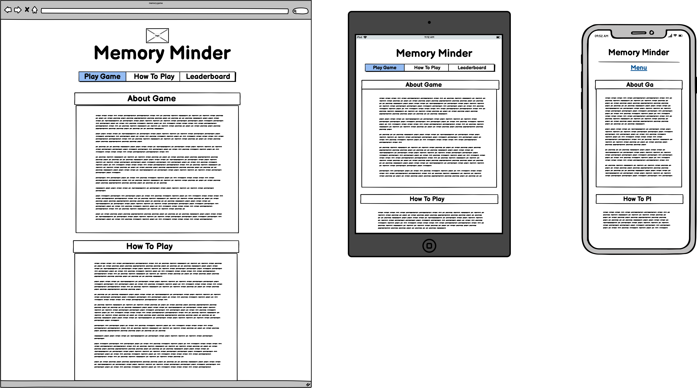
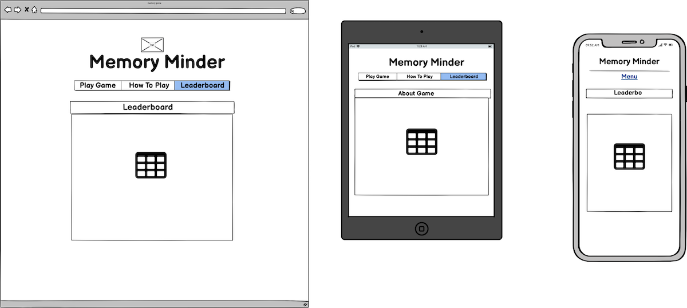

# Memory Minder - An Interactive Memory Game

[Visit the Deployed Site on github pages](https://nickassafkirk.github.io/Memory_Minder_Memory_Game/)

---
## Overview
Memory minder is a fun, interactive brain-training game designed for adults and children*. The game's purpose is to test the users memory, reaction-speed and recall while providing an enjoyable experience during gameplay.
To complete the game, the user must match all the tile pairs, in as few moves as possible and as quickly as they can. This game is a great excercise to challenge a user's short-term memory and reaction speeds and is the perfect activity for 
coffee breaks, keeping children entertained or killing some time while travelling on public transport. 

*while this game is perfectly suitable for children over 6. Parental supervision is recommended with user children, to ensure icons are appropriate for
younger users.

**NB** This project is for educational purposes only. All media utilised for this project is for educational use only.

---
## UX

With regards to the layout and structure of this project, a minimal design was intentionally chosen to encourage users to navigate to the sites main point of interest: the Game area.  
The addition of vibrant colors and a large range of interesting icons, themes and strong visual queues were chosen to offset the minimal design and provide a fun, casual
asthetic. Fonts with a "doodly", handwritten nature, bright primary colors and page layouts that are not dissimilar to copy books from 
school were chosen to fit a motif that reminds users of childhood and the enjoyment of distraction and simple childhood games.
Javascript was used extensively to generate a suite of strong user feedback methods, to engage game users, prevent user error
and encourage first time learning. 

---
## Strategy

### Ideal User
The ideal user for this site is: 
- An ideal user is 12 years or older.
- An ideal user will be technmology savvy.
- An ideal user will be a regular smart phopne/device user.
- An ideal user enjoys traditional games like card games, board games, sudoku, crosswords etc...

### User Goals
- A user wishes to enjoy themselves while playing the game.
- A user wishes to understand the game with minimal instruction.
- A user wants to start the game at their own leisure.
- A user wants to end the game when they wish.
- A user wants to be able to start a new game when they choose.
- A user expects a different board layout with each new game.
- A user needs to be notified if they have made a correct or incorrect move.
- A user needs to receive notification when they have completed a game.
- a user needs to set the difficulty level to match their ability
- A user wants to see their score when they have finished the game.
- A user wants to see their best score in a session.
- A user wants to remain interested after playing several games

### User Stories

- As a new user, I want to enjoy playing the game.
- As a new user, I want to understand how to play the game without having to read the instructions.
- As a new user, I want to be challenged by the game but not frustrated by it's level of difficulty.
- As a user, I need to set the difficulty level to match my ability or desired effort.
- As a return user, I want to see how my result compares to my previous attempts.
- As a return user, I expect a predictable and consistent gaming experience.
- As a user, I want to edit the game appearance to remain interested in the game.
- As a user, I want to be able to play the game on a mobile device.
- As a user, I need to receive feedback when a correct/incorrect move has been made.
- As a user, I expect the game to stop when I have completed the game.
- as a user, I need to be able to access game instructions if I need help understanding how to play the game.

---
## Scope 

### Features to be included in initial iteration
- A consistent page header and logo.
- A means to navigate between pages.
- A Game Board with up to 16 tiles.
- A Means to start and stop the game
- A Means to record, calculate and communicate a user's score.
- A "How to play" page to detail game rules and instructions.
- A leaderboard to display a user's top scores, to encourage aspiration for victory and repeat play.

### Features/Functionality to be added
- Add functionality to publish multiple user's scores to an online leaderboard. So multiple user's can compare their scores to 
those of other users.
- Add a story mode where additional levels of difficulty and new themes are automatically as a user accrues consecutive game wins.
- A child friendly mode designed for children between 5 -10. Child mode would include icons relevant and suitable for younger children. sucha s basic shapes, popular cartoon characters etc..
child mode would also include fewer tiles which are larger in size. 
- Add a feedback form to gather feedback or enquires from game users.
- A video or gif that demos gameplay to encourage first time learning.
- A click sound when a game tile is clicked.
- Add subtle animation to give imopression that tile is flipped over.
- Add style to highlight timer output in red when ten seconds left and/or play audio tone to notify that time is almost up.

---
## Structure

### Pages
#### 1. [Homepage](https://nickassafkirk.github.io/Memory_Minder_Memory_Game/index.html) 
The Primary landing page for the site where the gameboard is located.   

On initial page load this page includes:
- A prominent logo 
- A main navigation bar to allow user to navigate between site pages.
- A game settings bar which allows users to edit the gameboard to their preffered settings.
- A large **Start Game** button which encourages users to play the game without distraction.
- A frosted out preview of the game area, so first-time users can predict the game environment prior to starting a game.    

During gameplay this page includes:
- A prominent logo 
- A main navigation bar to allow user to navigate between site pages.
- A game settings bar which allows users to edit the gameboard to their preffered settings.
- A prominent game play area with 16 square tiles.
- An eye catching start button to start a new game which is disabled during gameplay.
- A prominent end game button which is disabled when a game has ended.
- A moves output which calculates and displays a user's moves count.
- A timer output which calculates and displays a user's time elapsed.   

On game completion this page includes:
- A scoreboard which hides the game play area and displays the user's final score or game ended message
- An eye catching **New Game** button allowing users to start a new game without refrshing the page.
- A disabled **End Game** button to reinforce that game has ended.
- A moves output which displays the moves count of a user's last game.
- A timer output which displays the time elapsed from a user's last game.  

#### 2. [How To Play](https://nickassafkirk.github.io/Memory_Minder_Memory_Game/rules.html)
This page includes: 
- A prominent logo 
- A main navigation bar to allow user to navigate between site pages.
- An About section which provides an introduction to the game's goals and intention.
- An explanation of how the game is scored.
- A step by step guide on how to play the game.

#### 3. [Leaderboard](https://nickassafkirk.github.io/Memory_Minder_Memory_Game/leaderboard.html)
This page includes: 
- A prominent logo 
- A main navigation bar to allow user to navigate between site pages.
- An prominent page heading which describes the page's meaning.

If new user visits the leaderboard.html page:
- A placeholder message is displayed which explains that leaderboard will only be displayed once a game has been 
successfully completed
- This message box includes a bold button which provides convenient navigation to the game page and encourages new users to play if they have landed on this page.

If a user has already completed >1 game:
- A prominent table will display up to a users top ten scores and the dates these scores were set on.

---

## Skeleton

### Navigation

There are limited navigation elements provided on this site. This is intentional and has been designed to encourage users to remain on the game play page
where they can continue game play.

Navigation elements include:
1. #### Logo 
 - A consistent logo present on each site page, links to site homepage to allow convenient access to index.html page and to encourage familiar first-time learning.
2. #### Main Navigation Bar:
 - A consistent top nav bar menu is present at the top of each page to allow navigation to the 3 key site pages from each individual webpage. 
 - The navbar utilizes Bootstrap's navbar collapse component to create a navbar which is compressed on smaller screen sizes to maximise available space for the gameplay area.
 - A **"Menu"** heading and berger stack icon is used to facilitate first-time learning of the collapsed navbar's purpose.

3. #### Pseudo-Buttons/Links:
- while `<button>` elements are exclusively used as gameplay controls as opposed to navigation elements, there are two applications where button-like objects are used for the purpose of navigation. 
 1. A link styled as a button is present on the leaderboard.html page if no scores have been retrieved from localStorage. While this is
 actually an anchor element styled with bootstrap's `.btn` class, it's purpose is the quickly transport new users to the index.html page, where they 
 can play the game and register scores.
 1. On the index.html a `div` element is styled in a button-like fashion to provide access to the game settings dropdown menu. While this does not navigate to a 
 new page, it provides access to a specific page section and as such has been considered a navgation feature.

### Wireframes  

#### Homepage (index.html)
  
 
#### How to play (rules.html)
 

#### Leaderboard (leaderboard.html)
    

#### Homepage: 

#### How To Play Page: 

### Mockups

A responsive view of the site can be found at [this link](http://ami.responsivedesign.is/?url=https%3A%2F%2Fnickassafkirk.github.io%2FMemory_Minder_Memo)

---
## Surface

The surface of this game is intended to present a fun and friendly experience for a broad-range of users. The design has been 
kept simple to keep attention on gameplay area; the sites primary focus. 
The fonts, colors and other styles have been chosen to produce an emotive child-like experience with the use of playful arts & crafts themed fonts and broad color palette dominated by vibrant primary colors.

### Fonts
Two fonts have been chosen for this project. 

1. [Finger Paint](https://fonts.google.com/specimen/Finger+Paint?preview.text_type=custom)
- This playful font has a playful hand drawn style, that fits the intended "childhood" motif I was trying to achieve. 
- The finger paint font is the primary font utilised sitewide.
- This font is for the Logo, main navigation, headings, button text, labels and in the leaderboard table. During testing it was
found to be adequately legible by multiple users. 
- In areas with larger passages of text, a different font has been chosen to improved readability.
2. [Patrick Hand](https://fonts.google.com/specimen/Patrick+Hand?preview.text_type=custom#standard-styles)
- This font was chosen to fit with the playful, light-hearted and juvenile that is aimed for this project. However this font was chosen to compliment
the Finger Paint font while improving readability of larger passages of text. 
- For this reason the Patrick hand font has been chosen for the section body sections of the rules.html page.
- Initially the [Patrick Hand SC](https://fonts.google.com/specimen/Patrick+Hand+SC?preview.text_type=custom) font was selected and though this font was preferred stylistically, during testing it was found to be difficult to 
read multi-line blocks of text because of it's uppercase style.
---

### Colors      
Colors are used to increase contrast, visual impact and to improve readability across the site. Colors are used during game play to faciliatate matching of tile pairs and reinforce the concept that tiles exist in matching pairs. 
The sites chosen color palette is dominated by primary colors
Root variables are used to allow quick stylisitic changes to be made and to facilitate future color changes if necessary. The main colors used on this project are as follows:

---

### Icons

#### Primary icons
Primary icons utilised for this project were sourced from [fontawesome.com](https://fontawesome.com/).
The selection of gathered for this project were designed to appeal to a broad range of users and to be appropriate for a wide-range of users. 
Icons which adhered to a specific theme/subject matter were used to create the different gameplay themes.
- Random: The random theme utilises an array of icons with no specific subject matter. Thes were chosen as the default theme to communciate the
random nature of each game. 
- Animals: The animals theme comprises of an array of animal icons. It was curated to appeal to a broad-audience because most people love animals.
- Explore: The explore theme is a collection of icons which have are related to the great outdoors and adventure. This them was chosen to appeal to the many people who are
craving some outdoor adventure having been deprived of the ability to travel in the current global climate.

Icons are also utilised as metaphors to reinforce meaning and encourage first-time-learning of key site components. 
for example: 
- The burger stack icon is used to denote the menus expandeable nature on smaller screen sizes. 
- The down caret arrow is used to indicate that the game settings bar is also expandable.
- The Trophy Icon is used as a metaphor to reinforce that the topscore is the best score in the game completion scoreboard.

#### Other Icons    
- The tick and cross Icons used to highlight correct and incorrect matches during gameplay. 
These two icons were sourced from [toptal.com](https://www.toptal.com/designers/htmlarrows/) and were chosen so they could be used
as values for `content` css property in the style.css stylesheet.
---

### Images 
- The lightbulb head image used in the Header Logo is the only image utilised in this project. It was chosen because It's a metaphor for bright-ideas
which I thought was particularly relevant to a brain-training game. It also has a quirky, random nature which is compliments and adds to the 
general quirky style of the project.

---

### Animations

Animations are used to highlight the interative/clickable nature of key site navigation elements and to provide dynamic user feedback during gameplay.

1. A css wiggle animation is utilised to create an interactive animation when a user hovers their cursor over the main navigation items.
This animation is achieved using pure css but is called using the javascript mouseover/mouseoff event listeners

1. Javascript timeouts are used to create animation-like event which highlights correct and incorrect match attempts by quickly adding a green mask and tick icon to correct
matches and and transparent red mask to incorrect matches. These animations are used to promote first time learning by teaching new users the behaviour when correct and 
incorrect matches are made.

---

## Testing

The current deployed version of this project has been thoroughly tested to ensure a great user experience on most common device types.
Testing has also confirmed compatibility with all common browsers to accommodate a great user experience and predictable functionality 
for as many users as possible. 

The responsive functionality of the site has been tested to work on most common devices with a 320px screen-width and larger. 

The full testing procedures carried out can be found in hte [testing.md file](testing.md)

### Validation

#### HTML5

All HTML pages in this deployed project successfully passed validation without returning any error or warnings. 
HTML files were validated using W3C's [Nu HTML Checker](https://validator.w3.org/nu/#textarea)
when files were initally passed through the validator an error was returned due to a # sign being accidentally included in the `aria-controls="#navbarCollapse"` property in the navbar. 
The # was subsequently removed and all HTML code passed validation without any errors or warnings.

#### CSS3    
The style.css file used to add custom styling to this project was validated using the [W3C CSS Validation Service](https://jigsaw.w3.org/css-validator/validator)
The CSS passed validation with 0 errors. 
14 warnings were returned:
One warning was returned because of imported fonts which are not checked when validating by direct input.
The other 13 warnings were due to the use of root variables, which can be ignored as root variables are currently not supported by this validator.  
When the style.css file was validated no errors were recorder but 35 warnings were returned. The additional 20 warnings were in relation to vendor prefixes which
are currently not supportede by the W3C css validation service.

#### Javascript

All javascript code was validated using [jshint](https://jshint.com/)
During the first validation attempt of the game.js file a number of missing semi colons and undeclared variables were identified and fixed. 
After which only one warning remined One warning: 
- "Expected an assignment or function call and instead saw an expression." Despite various efforts it was not possible to achieve the required game functionality without this warning. 
the scoreboard.js file and allpages.js files passed validation with no errors or warnings.

---

## Code 

### Vendor Prefixes
Vendor prefixes were added to the main stylesheet using [autoprefixer](https://autoprefixer.github.io/) to ensure styles are applied as consistently 
as possible across different browsers.

---

### Technologies Used

#### Languages, Libraries and Frameworks:

### HTML5 
[https://www.w3.org/html/](https://www.w3.org/html/) 

Is used to add content, structure and the ability to navigate to the website.

### CSS3
[https://www.w3.org/TR/CSS/](https://www.w3.org/TR/CSS/) 

Is used to add styles, layout, design and interactivity to the page and to increase usability to users across various devices. 

### Bootstrap V4.5.3 
[https://getbootstrap.com/](https://getbootstrap.com/) 

Is used to add structure, layout and a mobile-first responsive design to the website. 

jQuery and Popper.js are also referenced by bootstrap for responsive components like the navbar and collapse functionality.

While jQuery is referenced by Bootstrap, It was my decision to complete this project using vanilla js 

[Javascript](https://www.javascript.com/)
Javascript was used to add user interactivty to the project, to control the gameplay and logic of the game and to set and retrieve data to local storage. 

#### Other Technologies:

### Gitpod
[https://www.gitpod.io/](https://www.gitpod.io/) 

Is used to write, edit and preview code.

### GitHub 
[https://github.com/](https://github.com/)

Is used to host, share and deploy the project.

### Balsamiq
[https://balsamiq.com/](https://balsamiq.com/)

Is used to create wireframes as visual mockups of the final site design

---

## Credits

### Content Credits
All text is unique content written by me, ([Nick Kirk](https://github.com/nickassafkirk)) the project owner, for the purpose of this project. 

### Icons/Imagery

#### Images 

- Logo brain image: Brainstorm icon by Icons8
sourced from [icons8](https://icons8.com/icon/74713/brainstorm)

- HTML5 Logo: 
Sourced from [W3.org](https://www.w3.org/html/logo/#downloads)

- CSS3 Logo:
Sourced from [wikipedia commons](https://commons.wikimedia.org/wiki/File:CSS3_logo_and_wordmark.svg)

- Bootstrap Logo:
Sourced from [Wikipedia](https://en.wikipedia.org/wiki/Bootstrap_(front-end_framework))

- Gitpod Logo:
Sourced from [Gitpod](https://www.gitpod.io/media-kit/)

- Github Logo:
Sourced from [Github](https://github.com/logos)

- Balsamiq Logo:
Sourced from [Balsamiq](https://balsamiq.com/company/brandassets/)

- Javascript Logosourced from [wikipedia commons](https://commons.wikimedia.org/wiki/File:JavaScript-logo.png)

#### Icons
- Primary icons utilised for this project were sourced from [fontawesome.com](https://fontawesome.com/)
- CSS icons were sourced from toptal.com
- The correct css code used to add a check mark to css content property was found [here](https://www.toptal.com/designers/htmlarrows/symbols/check-mark/)
- The correct css code used to add a X mark to css content property was found [here](https://www.toptal.com/designers/htmlarrows/symbols/ballot-x/)

---

### Code Credits
The code in this project was written by me ([Nick Kirk](https://github.com/nickassafkirk)) the project owner. Any code snippets written by other developers or found from online resources have been credited
in the credits section below.

#### Set Interval to create countdown timer
- To enable score calculation and to add additional levels of difficulty a timer was added to the game. 
- To create this timer I researched the `setInterval()` function and found information in [this stackoverflow post](https://stackoverflow.com/questions/30427882/make-a-timer-using-setinterval)
which was used as a guideline to build my start timer function.
- original code `var count = 90;
var interval = setInterval(function(){
  setTime();
  if (count === 0){
    clearInterval(interval); // Stopping the counter when reaching 0.
  }
}, 1000);`

#### Prevent Timer being started more than Once
- If the timer was started more than once, it's speed would double causing inaccurate score calculation and a poor user experience.
- A solution was found at this [stack overflow post](https://stackoverflow.com/questions/31036619/timer-goes-twice-as-fast-when-triggered-again/31036796) which simply cleared the timer interval each time the
timer started to reset it and prevent this bug. 
- code: 
`function startTimer() {
    clearInterval(Timer);
    Timer = setInterval(myTimer, 100); 
}`

#### Pointer Events
- The `pointer-events: "none"` css property was used to prevent additional click events on correectly matched game tiles.
- Information regarding pointer-events was found at these links: 
  1. [Mozilla](https://developer.mozilla.org/en-US/docs/Web/CSS/pointer-events)
  1. [CSS Tricks](https://css-tricks.com/almanac/properties/p/pointer-events/)

#### CSS vmin/vmax
- To create a responsive gameboard, which has square game tiles across all screen sizes I used vmin values. I found information on vmin and vmax values in [this article](https://www.sitepoint.com/css-viewport-units-quick-)

#### Local Storage Credit
- When establishing a method by which game scores could be stored to local memory, I found information on passing values as JSON data at the following pages:
  1. [outline of JSON methods](https://m204wiki.rocketsoftware.com/index.php/List_of_Json_methods)
  1. [use of .stringify method](https://stackoverflow.com/questions/3357553/how-do-i-store-an-array-in-localstorage)
  I was also made awar of the stringify method by my mentor Nishant

#### Comparison Function
- A comparison function discovered in this [stack oveflow post](https://stackoverflow.com/questions/1129216/sort-array-of-objects-by-string-property-value)
is used to sort user game scores, so they can be listed in ascending order at the [leaderboard.html page](https://nickassafkirk.github.io/Memory_Minder_Memory_Game/leaderboard.html)
- **Original code** `function compare( a, b ) {
  if ( a.last_nom < b.last_nom ){
    return -1;
  }
  if ( a.last_nom > b.last_nom ){
    return 1;
  }
  return 0;
}
objs.sort( compare );`

---

## Deployment

This project was developed using the Gitpod IDE, committed to Git and pushed to GitHub using the terminal within Gitpod and the Gitpod extension for Chrome. 

---

### Deployment Instructions 
To deploy this page to GitHub Pages from its GitHub repository, the following steps were taken:

1. First log into [GitHub account](https://github.com/nickassafkirk).
1. From the list of pinned repositories on the home screen, select "Memory_Minder_Memory_Game".
1. From the menu items which includes *Code, Issues, Pull request, Actions, Projects, Wiki, Security, Insights and settings* 
select the **settings** tab.
1. Within the settings section, scroll down to the **GitHub Pages** section.
1. Under **Source** subheading click the drop-down menu labelled "None" and select "Master Branch"
1. Leave the default /Root folder selected and click save.
1. On selecting Master Branch and saving the page is automatically refreshed, the website is now deployed.
1. Return to the settings section and scroll back down to the GitHub Pages section to retrieve the link to the deployed website.
1. (Optional) Add the website link to the repository info box for ease of use. In the sidebar to the right click the cog icon to the right of the about subheading
and paste the website url into the box labelled "website"

---
### Cloning instructions with Gitpod
To clone this project using Gitpod you will need:

A Github account. [Create a Github account here](https://github.com/join)
Use the Chrome browser
Then follow these steps:

1. Install the [Gitpod Browser Extentions for Chrome](https://chrome.google.com/webstore/detail/gitpod-dev-environments-i/dodmmooeoklaejobgleioelladacbeki?hl=en)
2. After installation, restart your browser
3. Log into Gitpod with your github account.
4. Navigate to the [Project GitHub repository](https://github.com/nickassafkirk/Memory_Minder_Memory_Game)
5. Click the green "Gitpod" button in the top right corner of the repository
6. This will open a new gitpod workspace with a clone of the repository

---
### Cloning instructions to a local editor
To work on the project code within a local IDE such as VSCode, Pycharm, brackets etc:

1. Go to the Github repository at [this link](https://github.com/nickassafkirk/Memory_Minder_Memory_Game)
2. Under the repository name, click the code tab from the menu items
3. In the submenu to the right which has the options: go to file, add file and code, select the code option. 
4. In the Clone with HTTPs section, copy the clone URL for the repository.
5. In your local IDE open the terminal.
6. Change the current working directory to the location where you want the cloned directory to be made.
7. In the terminal type git clone, and then paste the URL you copied in Step 3.
   This should follow the format git clone https://github.com/github-username/repository-name.git
8. Press Enter to successfully clone the repository to your local IDE
9. For more information on cloning from github [see this page](https://docs.github.com/en/free-pro-team@latest/github/using-git/which-remote-url-should-i-use)

---

### Forking instructions
To Fork this repository:

1. Go to the [github homepage](https://github.com/).
1. Sign into Github or sign up for a new account.
1. Find the repository you wish to fork. 
(*([For example this project](https://github.com/nickassafkirk/Memory_Minder_Memory_Game))*
1. On the right hand side of the repository page you will see options to watch, star or fork. Click Fork.
1. This will create a copy of the project in a new repository within your github account.
1. Once the fork has been created in your github account, it can then be cloned to your prefered editor using one of the methods outlined above.
1. After changes have been made locally they can be submitted via pull request for approval and inclusion in the original project.

---

## Acknowledgements

I'd like to thank my mentor Nishant Kumar for his help and advice throughout this project. His encouragement and feedback we're invaluable in the completion of this project.
I would also like to thank my friends Scott, Paul and many others who helped me test this project on multiple devices and provided feedback

