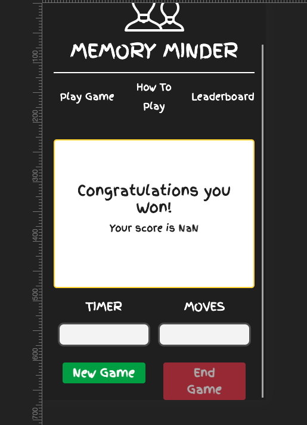

# Memory Minder Memory Game

[Visit the Deployed Site on github pages](https://nickassafkirk.github.io/Memory_Minder_Memory_Game/)

---
## Overview
Memory minder is a fun, interactive brain training game designed for adults and children. Test your memory reaction speed and recall
to complete the game in as few moves as possible and as quickly as you can. This game is a great excercise to challenge your short-term memory and reaction speeds and is the perfect activity for 
coffee breaks, or killing some time on the way home from work. 

---
## UX


---
## Strategy

### Ideal User
The ideal user for this site is: 
- Any user 5 years or older
- An ideal user will be a regular smart device user
- An ideal user enjoys traditional games like card games, board games, sudoku, crosswords etc...

### User Goals
- A user wishes to enjoy themselves while playing the game.
- A user wishes to understand the game with minimal instruction.
- A user wants to start the game at their own leisure.
- A user wants to end the game when they wish.
- A user wants to be able to start a new game when they choose.
- A user expects a different board layout with each new game.
- A user wants to be notified if they have made a correct or incorrect move.
- A user wants to receive notification when they have completed a game.
- A user wants to see their score when they have finished the game.
- A user wants to see their best score in a session.

### User Stories

- As a new user, I want to enjoy playing the game.
- As a new user, I want to understand how to play the game without having to read the instructions.
- As a new user, I want to be challenged by the game but not frustrated by it's level of difficulty.
- As a return user, I want to see how my result compaers to my previous attempts.

---
## Scope 

### Features to be included in initial iteration
- A consistent page header and logo.
- A means to navigate between pages.
- A Game Board with up to 16 tiles.
- A How to play page to detail game rules and instructions.
- A leaderboard to display a users score and to encourage aspiration for victory and repeat play.
- A child mode with easier game play and suitable tile icons.
- A feedback form to provide feedback to the game owner.

### Features/Functionality to be added
- Publish users scores to an online leaderboard.
- Add a story mode where additional levels of difficulty are added based on win streaks.

---
## Structure

### Pages
#### 1. [Homepage](https://nickassafkirk.github.io/Memory_Minder_Memory_G) 
The Primary landing page for the site where the gameboard is located. 
This page includes: 
- a main navigation bar to allow user to navigate between site pages.
- Game control buttons allowing users to start/Stop gameplay

#### 2. [How To Play](https://nickassafkirk.github.io/Memory_Minder_Memory_Game/rules.html)
This page provides users with: 
- An introductiuon to the game's goals and intention
- A step by step guide on how to play the game.
- An explanation of how the game is scored.

#### 3. [Leaderboard]()
---
### Detailed Features

#### [Homepage]() 
#### [How To Play]() 
#### [Leaderboard]() 
#### [404]() 


---
## Skeleton

### Navigation

1. **Main Navigation:** A consistent top nav bar menu is present at the top of each page to allow navigation to the key site pages from each individual webpage. 
2. **Buttons:** 


### Wireframes

#### Homepage: Desktop View


#### How To Play Page: Desktop View


### Mockups


A responsive view of the site can be found at [this link](http://ami.responsivedesign.is/)

---
## Surface

### Fonts
**General**     

---

### Colors      
Colors are used to increase contrast, visual impact and to improve readability across the site.Colors are used during game play to aciliatate matching of tile pairs.
Root variables are used to allow quick stylisitic changes to be made and to facilitate future color changes if necessary. The main colors used on this project are as follows:

---

### Icons

All icons utilised for this project were sourced from [fontawesome.com](https://fontawesome.com/).

---

### Images 

---

### Animations


---

## Testing

The current deployed version of this project has been thoroughly tested to ensure a great user experience on most common device types.
Testing has also confirmed compatibility with all common browsers to accommodate a great user experience and predictable functionality 
for as many users as possible. 

The responsive functionality of the site has been tested to work on most common devices with a 320px screen-width and larger. 

---

## Code 

The code in this project was written by me ([Nick Kirk](https://github.com/nickassafkirk)) the project owner. Any code snippets written by other developers or found from online resources have been credited
in the credits section below.

### Bugs

**Bug:** If start Game button is clicked when timer is already running, The timer speeds up and the end game button no longer stops the game.
**Fix:** clearInterval(timer) when the startTimer function is called before doing anything else. This resets the timer each time the timer is run
credit: solution was found at this [stack overflow post](https://stackoverflow.com/questions/31036619/timer-goes-twice-as-fast-when-triggered-again/31036796)

**Bug:** User could click on tiles before pressing the startGame button. This enabled to get a head start by matching tiles before the timer had started. 
**Fix:** The click event listeners on each game tile are only initiated when the game has been started by clicking the startGame button.

**Bug:** When ***"End Game"*** button was clicked, the ***"New Game"*** button was not not displaying as equal height top the end button.   
**Fix:** Template literal was used to insert a <br> element to be displayed on small screensizes. This <br> element was accidentally removed when the innerText
of the button was changed on button click.



**Bug** An extra value was being added to the moves score output box upon game completion. 
**Fix** the countClicks() function was being called by the calculateScore() function upon game completion as a result an
extra increment was being added to the moves counter when the game was completed. TYo fix this the calculation was changed to use the clicks value which is returned by the 
countClicks() function so that the moves box does not display the incorrect answer on game completion

**Bug** Re-clicking a correctly matched tile changed it's background-color. While this did not affect the functionality of the game( ie it did not register as a click, move or affect the scoring etc...)
it was deemed confusing, as user may interpret a change of color as a sign that this tile is still available for use. 
**Desired behaviour** Correctly matched tile pairs should have matching background colors and should have all event listeners removed to prevent any further involvement in the game or
additional style changes.
**Source of Bug** The issue was found to be due to a click event listener that is was applied within the setTiles function (shown below), This click event listener calls an anonymous function which assigns a matching background color to each pair of tiles, to be revealed  when each tile is clicked and revealed. 
As the event listener calls an anonymous function, it was not possible to then remove this event listener when the tile was matched correctly. Extracting this functionality out to a function declared at global scope was not possible because the function requires a parameter to be passed that would then be uinnacessible at global scope.
Using the e.target method was also not suitable because again the necessary parameter could not be passed to the function.         
    
    `function assignTileInner(tileThemeArray, bgColors, num) {
        tile.innerHTML = tileThemeArray[num];
        tile.setAttribute("icon", tileThemeArray[num])
        tile.addEventListener("click", function(){
            this.style.backgroundColor = bgColors[num];
        })**
      }`

**Fix** The pointer-events css property was applied to each correctly matched tile pairs in the setCorrectMatch function.

`document.getElementById(tileIds[count]).style.pointerEvents = "none";`

While this is not an ideal fix and ideally unneccessary event listeners should be removed, it works as intended and has not been shown 
to cause any issues in testing. An alternative method would be to clone the element to which the event listener is applied and then replace the cloned element with the clone.
This would also remove all event listeners and is documented in [this stackoverflow post](https://stackoverflow.com/questions/9251837/how-to-remove-all-listeners-in-an-element)

**Credit** 
information about pointer-events was found at these links: [Mozilla](https://developer.mozilla.org/en-US/docs/Web/CSS/pointer-events), [CSS Tricks](https://css-tricks.com/almanac/properties/p/pointer-events/)
### Frameworks
**Bootstrap** CDN was used to create a responsive site design. Several bootstrap components were utilised including navbar, jumbotrons, alerts, modals, forms and the collapse functionality. 
Custom CSS was used to apply unique styling to bootstrap components.

### Vendor Prefixes
Vendor prefixes were added to the main stylesheet using [autoprefixer](https://autoprefixer.github.io/) to ensure styles are applied as consistently 
as possible across different browsers.

---

## Technologies Used


### HTML5 
[https://www.w3.org/html/](https://www.w3.org/html/) 

Is used to add content, structure and the ability to navigate to the website.


### CSS3
[https://www.w3.org/TR/CSS/](https://www.w3.org/TR/CSS/) 

Is used to add styles, layout, design and interactivity to the page and to increase usability to users across various devices. 


### Bootstrap V4.5.3 
[https://getbootstrap.com/](https://getbootstrap.com/) 

Is used to add structure, layout and a mobile-first responsive design to the website. 

Javascript, jQuery and Popper.js are also referenced by bootstrap for responsive components like the navbar, modals, collapse and accordian.


### Gitpod
[https://www.gitpod.io/](https://www.gitpod.io/) 

Is used to write, edit and preview code.


### GitHub 
[https://github.com/](https://github.com/)

Is used to host, share and deploy the project.


### Balsamiq
[https://balsamiq.com/](https://balsamiq.com/)

Is used to create wireframes as visual mockups of the final site design

---

## Credits

### Content Credits
All text is unique content written by me, ([Nick Kirk](https://github.com/nickassafkirk)) the project owner, for the purpose of this project. 
---
### Code Credits
Images:


- Inspiration for animation used in menu.html subnav was from [this stack overflow discussion](https://stackoverflow.com/questions/42745506/how-to-make-an-icon-spin-with-i-tag-in-html5-through-css3) and general animation info was found at [this page](https://www.w3schools.com/cssref/css3_pr_animation-keyframes.asp)
    ```
        $(document).ready(function() {
            $('.js-spin').click(function() {
            $(this).addClass('icn-spinner') //remove class to stop animation
            });
        });

    i {
    font-size: 40px;
    }

    .icn-spinner {
        animation: spin-animation 0.5s infinite;
        display: inline-block;
    }

    @keyframes spin-animation {
        0% {
            transform: rotate(0deg);
        }
        100% {
            transform: rotate(359deg);
        }
    }
    ```

 
- To apply favourable modal positioning I used a technique described in [this article](https://css-tricks.com/considerations-styling-modal/)
    from which I utilised this snippet of code 
    ```
        .modal {
        position: fixed;
        top: 50%;
        left: 50%;
        transform: translate(-50%, -50%);
        }
    ```


- To add a wiggle functionality to the menu pages call Icons/Images, I customised code found at [this codepen demo](https://codepen.io/theDeanH/pen/zBZXLN)
  This animation was customised for use in this project to include properties that do not include vendor prefixes. The original code segment is as seen below: 

    ```
    p:hover {
    -webkit-animation-name: wiggle;
    -ms-animation-name: wiggle;
    -ms-animation-duration: 1000ms;
    -webkit-animation-duration: 1000ms;
    -webkit-animation-iteration-count: 1;
    -ms-animation-iteration-count: 1;
    -webkit-animation-timing-function: ease-in-out;
    -ms-animation-timing-function: ease-in-out;
    }

    @-webkit-keyframes wiggle {
    0% {-webkit-transform: rotate(10deg);}
    25% {-webkit-transform: rotate(-10deg);}
    50% {-webkit-transform: rotate(20deg);}
    75% {-webkit-transform: rotate(-5deg);}
    100% {-webkit-transform: rotate(0deg);}
    }

    @-ms-keyframes wiggle {
    0% {-ms-transform: rotate(1deg);}
    25% {-ms-transform: rotate(-1deg);}
    50% {-ms-transform: rotate(1.5deg);}
    75% {-ms-transform: rotate(-5deg);}
    100% {-ms-transform: rotate(0deg);}
    }

    @keyframes wiggle {
    0% {transform: rotate(10deg);}
    25% {transform: rotate(-10deg);}
    50% {transform: rotate(20deg);}
    75% {transform: rotate(-5deg);}
    100% {transform: rotate(0deg);}
    }
    ```

---

### README Credits

#### Images

Logo brain image:
from: https://icons8.com/icons/set/brain
img: 
credit: <a href="https://icons8.com/icon/74713/brainstorm">Brainstorm icon by Icons8</a>

HTML5 Logo: 
Sourced from [W3.org](https://www.w3.org/html/logo/#downloads)

CSS3 Logo:
Sourced from [wikipedia commons](https://commons.wikimedia.org/wiki/File:CSS3_logo_and_wordmark.svg)

Bootstrap Logo:
Sourced from [Wikipedia](https://en.wikipedia.org/wiki/Bootstrap_(front-end_framework))

Gitpod Logo:
Sourced from [Gitpod](https://www.gitpod.io/media-kit/)

Github Logo:
Sourced from [Github](https://github.com/logos)

Balsamiq Logo:
Sourced from [Balsamiq](https://balsamiq.com/company/brandassets/)

#### Icons:
All icons used on this project were sourced from [Fontawesome](https://fontawesome.com/).

---

## Deployment

This project was developed using the Gitpod IDE, committed to Git and pushed to GitHub using the terminal within Gitpod and the Gitpod extension for Chrome. 

---

### Deployment Instructions 
To deploy this page to GitHub Pages from its GitHub repository, the following steps were taken:

1. First log into [GitHub account](https://github.com/nickassafkirk).
1. From the list of pinned repositories on the home screen, select "Cartel-Coffee".
1. From the menu items which includes *Code, Issues, Pull request, Actions, Projects, Wiki, Security, Insights and settings* 
select the **settings** tab.
1. Within the settings section, scroll down to the **GitHub Pages** section.
1. Under **Source** subheading click the drop-down menu labelled "None" and select "Master Branch"
1. Leave the default /Root folder selected and click save.
1. On selecting Master Branch and saving the page is automatically refreshed, the website is now deployed.
1. Return to the settings section and scroll back down to the GitHub Pages section to retrieve the link to the deployed website.
1. (Optional) Add the website link to the repository info box for ease of use. In the sidebar to the right click the cog icon to the right of the about subheading
and paste the website url into the box labelled "website"

---
### Cloning instructions with Gitpod
To clone this project using Gitpod you will need:

A Github account. [Create a Github account here](https://github.com/join)
Use the Chrome browser
Then follow these steps:

1. Install the [Gitpod Browser Extentions for Chrome](https://chrome.google.com/webstore/detail/gitpod-dev-environments-i/dodmmooeoklaejobgleioelladacbeki?hl=en)
2. After installation, restart your browser
3. Log into Gitpod with your github account.
4. Navigate to the [Project GitHub repository](https://github.com/nickassafkirk/Memory_Minder_Memory_Game)
5. Click the green "Gitpod" button in the top right corner of the repository
6. This will open a new gitpod workspace with a clone of the repository

---
### Cloning instructions to a local editor
To work on the project code within a local IDE such as VSCode, Pycharm, brackets etc:

1. Go to the Github repository at [this link](https://github.com/nickassafkirk/Memory_Minder_Memory_Game)
2. Under the repository name, click the code tab from the menu items
3. In the submenu to the right which has the options: go to file, add file and code, select the code option. 
4. In the Clone with HTTPs section, copy the clone URL for the repository.
5. In your local IDE open the terminal.
6. Change the current working directory to the location where you want the cloned directory to be made.
7. In the terminal type git clone, and then paste the URL you copied in Step 3.
   This should follow the format git clone https://github.com/github-username/repository-name.git
8. Press Enter to successfully clone the repository to your local IDE
9. For more information on cloning from github [see this page](https://docs.github.com/en/free-pro-team@latest/github/using-git/which-remote-url-should-i-use)

---

### Forking instructions
To Fork this repository:

1. Go to the [github homepage](https://github.com/).
1. Sign into Github or sign up for a new account.
1. Find the repository you wish to fork. 
(*([For example this project](https://github.com/nickassafkirk/Memory_Minder_Memory_Game))*
1. On the right hand side of the repository page you will see options to watch, star or fork. Click Fork.
1. This will create a copy of the project in a new repository within your github account.
1. Once the fork has been created in your github account, it can then be cloned to your prefered editor using one of the methods outlined above.
1. After changes have been made locally they can be submitted via pull request for approval and inclusion in the original project.

---

## Acknowledgements

I'd like to thank my mentor Nishant Kumar for his help and advice throughout this project. His encouragement and feedback we're invaluable in the completion of this project.


