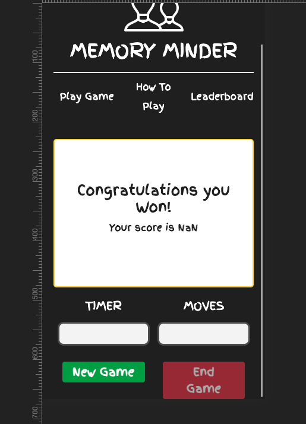
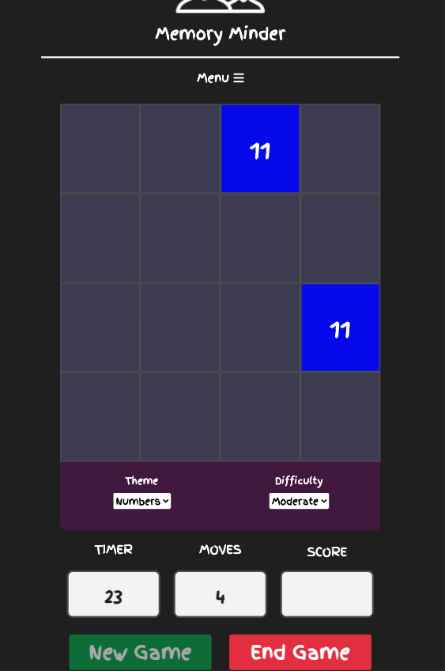

[Link to README.md](README.md)

Link to deployed site](https://nickassafkirk.github.io/Memory_Minder_Memory_Game/)

## Compatibility

Compatibility testing involved going through the site thoroughly to ensure that the format, layout, styles and functionality of the site perform as intended. 

Testing involved: 

1. Testing the site using multiple browsers to ensure cross-browser compatibility.
   The following browsers were tested for the current deployed version of this site:

   | Browser       | Compatible |
   | --------------|------------|
   | Chrome        |   &#9745;  |
   | Safari        |   &#9745;  |
   | Firefox       |   &#9745;  |
   | Opera         |   &#9745;  |
   | Microsoft Edge|   &#9745;  |

   Unfortunately it was not possible to test the site functionality on internet explorer as no version was available for IOS. 

1. Testing the site across a range of devices to ensure a responsive site that provides a great user experience on all devices.
   The site was tested on: 

   | IOS           | Windows/Android         |
   |---------------|-------------------------|
   |M1 Mac Mini    |  Honor 20 Pro           |   
   |Macbook Pro 13"|  Samsung Galaxy s6      |        |              
   |Iphone 6s Plus |             
   |Iphone SE      |  
   |Iphone XS      |
   |Ipad Mini      |
   
1. Testing the site using chrome dev tools to confirm desired functionality across all breakpoints and screen-widths. 

1. Additional testing was carried out by asking friends and family to test the site and to provide feedback on a range of devices. 

---

## User Story Testing

---

1. ### As a new user, I want to enjoy playing the game.
- To test: I played the game several times and then shared the game with multiple friends and family. Having received responses from multiple people, the unanimous decision was that users enjoyed the game and found it easy to use. the feedback was generally positive and 
multiple users send screenshots to show that they had beaten their top scores.
- Result: The tests carried out satisfy the user story that the game must be enjoyable for new users.

2. ### As a new user, I want to understand how to play the game without having to read the instructions.
- To test: A new user lands on the homepage. A new user sees a large green start game button. There are no other buttons that are available to the user except the game settings dropdown. The user is forced to press the start game button. 
Once the button is pressed the timer starts, this indicates to the user that the game has started. The only clickable elements available to the user are the end button and the tiles. Therefore the user must click a tile. On clicking a tile 
a tile's image is revealed. The selected tile remains revealed. Clicking th selected tile again has no affect. The user has no option but to click another tile. If the second guess is wrong, a red mask is flashed over the tile and both tiles are hidden again. This indicates that an incorrect move has been made. 
If a correct match is made a green mask flashes over the tiles and they remain displayed. If user clicks on the correctly matched tile, it has no effect, therefore user must select another unmatched tile. A user will continue matching tiles until all tiles are matched, time runs out or they end the game by pressing the end button.
If the time runs out a message is displayed on the scoreboard that time ran out, this teaches the user that they must complete the game within th allotted time or they will fail. If the user ends the game a mesasge is displayed which teaches the user that a score is only registered if the game is completed. 
If the user correctly matches all the tiles and finishes the game, then their score will be displayed on the scoreboard. This teaches the user that when they finish a game their score will be retunred.
for all 3 scenarios, upon game completion the only active button is now the new game button. This means after completing the game, a user can only start a new game or visit another site page by accessing it from the main navigation.
If the user still needs help, there's a large how to play option in the main navigation. This indicates that instructiional material is available if necessary which improves user confidence.
- Result: By following the steps above it's clear that the game fulfils the user story outlined above.

3. ### As a new user, I want to be challenged by the game but not frustrated by it's level of difficulty.
- To test: a user lands on the index.html page. Having played the game once and ran out of time, the user  establishes that the game level is too hard. After ending a game a bright game settings banner is displayed above the game area.
clicking this banner opens a dropdown whcih includes a difficulty dropdopwn. The user selects the easy option. The user starts a new game and plays the game again. This time the user completes the game within the allotted time. The user is satisfied with the level of difficulty.
Having played the game several times, the user wants to allow themselves a harder challenge. The follow the steps as outlined before and select a harder difficulty. They play the game and experiment with the different levels until their preferred level is set. 
-Result: The game fulfils the user story outlined above.

4. ### As a return user, I want to see how my result compares to my previous attempts.
- To Test: Having completed the game once a users score and top score is displayed on the scoreboard pop up. After completing a second game their current score and top score are displayed on the scoreboard again. This allows the user 
to compare their last completed score against their best score. If a user closes the tab or browser and returns to the game, they are able to play the game again. If they successfully complete the game, their current score will be displayed as well as their best score from
a previous session. The user will also see a prominent score board label as one of only three items in the navigation page. 
Clicking this link will bring the user to the scoreboard page where they can view their top ten scores and the date they achieved that score. 
If a new user who has not completed a game visits the score board page, a message informs the user that scores will only be loaded once a game has been successfully completed. 
This encourages the user to play the game. 
- Result: By following the steps above it is clear that the game satisfies the user story outlined above.

5. ### As a return user, I expect a predictable and consistent gaming experience.
- To Test: Open a new browser and open up the game. Following the steps outlined above the user can play the game. 
If the user then closes the browser. The user then returns to the game at at a later date and plays the game again. 
- Result -By following the steps above it is observed that the game renders consistently each session. By testing the game during multiple sessions on an array of devices it is observed that the game is consistent and repeatable 
over multiple sessions. Therfore it is concluded that the game meets the defined user story.

6. ### As a user, I want to edit the game appearance to remain interested in the game.
- To test: a user lands on the index.html page. There are two bright objects that are immediately obvious on the page. The first is a large green button in the center of the page, the second is a bright banner that reads "game settings"
having played the game, the user clicks the game settings bar out of curiosity. In this menu the user can see two options: one for difficulty and the first for theme. Clciking the dropdown reveals 4 options. The user selects the animals theme and then clicks the start button. 
Once playing the user observes that the icons have changed. The user has now learned what the themes dropdown does. Once finished a game the user can try another theme until they have tried all of the themes. The user can then continue to play using their preferred theme for future games.
- Result: By following the steps above and observing the results, it is clear that the game satisfies the user story outlined above.

7. ### As a user, I need to receive feedback when a correct/incorrect move has been made.
- to Test: Repeat steps as in user story #2. Once playing a game, on clicking a tile 
a tile's image is revealed. The selected tile remains revealed. Clicking the selected tile again has no affect. The user has no option but to click another tile. If the second guess is wrong, a red mask is flashed over the tile and both tiles are hidden again. This indicates that an incorrect move has been made using the familiar traffic light metaphor. 
If a correct match is made a green mask flashes over the tiles and they remain displayed. If user clicks on the correctly matched tile, it has no effect, therefore user must select another unmatched tile. 
- Result: As outlined above the game satisfies the needs outlined in the user story above.

8. ### As a user, I expect the game to stop when I have completed the game.
- To Test: When playing a gamee, A user will continue matching tiles until all tiles are matched, time runs out or they end the game by pressing the end button.
If the time runs out a message is displayed on the scoreboard that time ran out, this teaches the user that they must complete the game within th allotted time or they will fail. If the user ends the game a mesasge is displayed which teaches the user that a score is only registered if the game is completed. 
If the user correctly matches all the tiles and finishes the game, then the timer will stop, the gamearea will disappear and their score will be displayed on the scoreboard. The congratulations message notifies the user that the game has eneded. This teaches the user that when they finish a game their score will be returned.
For all 3 scenarios, upon game completion the only active button is now the new game button. This means after completing the game, a user can only start a new game or visit another site page by accessing it from the main navigation.
- Result: By playimg the and observing the behaviour, It's clear that the user story outlined above is met.

9. ### as a user, I need to be able to access game instructions if I need help understanding how to play the game.
- To Test: When ladning on any site page a user will see a consistent main navigation menu. This contains three links. One labelled play game, the next how to play and the final value reads scoreboard. 
The second option **How to play** clearly describes it's purpose which makes it easy for new users to find additional information on how to play the game. Clicking the link brings the user to a clearly labelled page with two sections. 
The first about section outlines the objective of the game and how scoring is calculated. The second section, labelled "how to play" outlines gameplay step by step. The user can then play the game and follow the steps outlines in the instructions. The user can stop the game at any time and can access the how to play page from all site pages, should they need to reference the instructions
at a later date. 
-Result: By testing the user story above it is clear that the game instructions are easy to find, accessible from all pages on the site and are easy to read and understand. As such it is 
concluded that the user story outlined abobe is satisfied. 

## Manual Testing

### General elements
for each page (index.html, rules.html, leaderboard.html)

1. click logo to top of page.
  - predicted behaviour: refresh or link to index.html
  - observed behaviour: When clicking logo the page refreshs or link to the index.html page from all pages.

2. Test Navbar links
 - predicted behaviour:  Play Game links to index.html, How To Play links to rules.html
 and Score Board links to leaderboard.html
 - observed behaviour: Navbar items all link to their correct page from each page.

3. Test Navbar link animation
  - predicted behaviour: Nav item should display wiggle effect on cursor on and the wiggle effect should stop when the cursor is hovered of the nav item.
  - observed behaviour: On hover the animation event is carried out as intended. On touch devices the nav items will begin wiggle when clicked, but no timeout has been added to allow animation to 
   finish before user is redirected to desired page. This behaviour is deemed acceptable, because adding a delay could frustrate some users. 

### index.html
[Go to index.html](https://nickassafkirk.github.io/Memory_Minder_Memory_Game/index.html)

Test page render on page load.
- predicted behaviour: Index page will appear with prominent start button in center of game area awith transparent overlay partially shielding game area. 
Only the start button, game settings menu and header will be visible on the page.
- observed behaviour: When the index.html page is refresh the behaviour displayed is as descibed above.

Test Game settings menu
- predicted behaviour: Clicking game settings label will reveal the dropdown menu, reclicking will hide the drop down.
selecting a theme in the Theme select and starting the game will set the icons to the appropriate them. Setting the difficulty will set the gamplay time to the appropriate value, when the game commences. '
The game settings menu will disappear when the game is in play. The game settings menu will reappear.
- observed behaviour: All of the conditions described above were tested and observed to be operating as intended. Console.logs were used to double check that gaem time and game them values were assigned correctly. 

Test Click each tile to reveal it's value
- predicted behaviour: when game in play, clicking a tile will reveal it's value and a random background color. The selected tile will not be clickable until a different tile has been matched. 
- observed behaviour: The conditions above were tested and observed to be operating as intended. 

Test Incorrect match
- predicted behaviour: when two tiles with non-matching tiles are selected both tiles will be briefly highlighted with red semi-transparent overlay before being returned to it's default
hidden values with a navy background and no icon displayed. Neither tile will be re-selectable until red overlay has been removed and tiles have been hidden.
- observed behaviour: many games were started and completed and during this testing incorrect matches were observed to display the desired behaviour outlined above.

Test Correct match
- predicted behaviour: When two tiles are matched correctly, both tiles will have the same icon or number and both will have a matching background color. On match both tiles will be briefly highlighted with a green semi-transparent overlay. They will then remain displayed "face-up" and will be unclickable for the duration of the game. 
- observed behaviour: Multiple test games were run and the predicted behaviour outlined above was displayed each time. As such the correct match functionality is operating as intended.

Test Timer
- predicted behaviour: when game starts the timer will start and it's current value will be displayed in the timer output. The timer will continue counting in seconds until the game is completed, ended by the user or if the time runs out. Once the game ends the time elapsed at finish will 
be displayed in the timer output. If the time runs out, the time at finish will be replaced with the string "Time Up"
- observed behaviour: The game was tested many times. Each time it was observed that the timer started on game start and ended on game end. The timer was tested after each game difficulty was selected and after each theme was applied and allowed to run until the time ran out. For each difficulty level the time elapsed observed was as intended in the game's specification.
for each theme the timer also started and stopped as intended.

Test Move counter 
- predicted behaviour: for every tile match attempt during a live game, the moves output should register one move for every two unique clicks/moves.
The move counter should not register a move if either tile of a correctly matched pair is clicked or if a first guess that has not had a subsequent 
match attempt is reclicked.
- observed behaviour: The game was tested thoroughly across browsers and devices and was observed to behave as intended.

Test End button
- predicted behaviour: When a gae is ended the end button should be disabled. When a game is in play the end game should be enabled.
Pressing the end game button during a game should display the scoreboard with the message "Game over - you quit before finsihing".
Once pressed the New Game button should be enabled to allow the user to start a new game without refreshing th window.
- observed behaviour: Many test games were played and the end button was observed to be working as intended in all instances.

Test start button
- predicted behaviour: Clicking start button should first reset the game board, timer output, moves output and shuffle the tiles. Once clicked start button will disable the start button and enable the end button. The timer will also be started. Once the start button has been pressed all tiles will be clickable until they have been matched correctly. When the end button is pressed,
the start buttons text will change to new game.
- observed behaviour: Many test games were played and the start button was observed to be working as intended in all instances.

Test complete game
- predicted behaviour: when all tiles have been successfully matched, the game should end. The timer should stop counting as will the moves output. 
The scoreboard should appear to replace the game-area. The scoreboard message will say congratulations and print the current score and the best score. 
- observed behaviour: The game was tested multiple times across different devices and browsers. The complete game functionality was observed to work correctly using all themes and on all difficulty levels. 
Game completion is operating as intended.

Test Display scoreboard
- predicted behaviour: When a game ends the scoreboard will replace the game area. If the calculated score is the lowest score, the scoreboard will notify the user that they have set a new top score. If not the score will be compared to the current top score.
- observed behaviour: The scoreboard was displayed by completing the game several time, by ending games prematurly and by letting the clock run out. The scoreboard was observed to operate as intended.

Test calculate score
- predicted behaviour: when the game ends the score should be calculated by returning the sum of the time elapsed and the number of moves.
The score will be printed on the scoreboard to provide user feedback. The score will be posted to the leaderboard if it is opne of the user's ten best scores. 
- observed behaviour: The calculate score functionality was tested by completing several games and by using console.logs to log the scores value at multiple points in the code's execution. The calculate score functionality was observed to operate effectively after initial bugs were fixed.

Test New game button
- predicted behaviour: Clicking new game button should first clear the scoreboard, then reset the game board, timer output, moves output and shuffle the tiles. Once clicked new game button will become disabled and  the end button will be enabled. The timer will start when the new game is clicked and will continue to count until the game is finished. 
Once the start button has been pressed all tiles will be clickable until they have been matched correctly. When the end button is pressed,
the new game button will be reenabled.
- observed behaviour: Many test games were played and the new game button was observed to be working as intended in all instances.

### rules.html
[go to rules.html](https://nickassafkirk.github.io/Memory_Minder_Memory_Game/rules.html)

Test Rules sections format correctly
- predicted behaviour: there should be two distinct sections on the rules.html page. Both should have colored headings and light-colored section bodies. 
all sections should scale correctly to fit on the page. No overflow should occur on screensizes >320px wide. Fonts should adjust to ensure a correct fit for the screen size in use.
- observed behaviour: The rules.html page was viewed on all listed browsers, on multiple devices and in responsive mode in dev tools. It was confirmed that readbility and font-size have been optimised for
most common screensizes. No overflow was onserved and the sections are styled as anticipated. The rules.html page is rendering as intended.

### leaderboard.html
[go to leaderboard.html](https://nickassafkirk.github.io/Memory_Minder_Memory_Game/leaderboard.html)

Test Leaderboard Message for first-time user
- predicted behaviour: When a new user who has recorded no scores visits the leaderboard.html page, A message bbox
should display a message that the user needs to complete the game to register a score. The message should also provide a link styled like a button which directs the user to 
the index.html page where they can commence game play. 
- observed behaviour: By clearing local storage I was able to emulate first time user experience. I observed that the message was displaying as anticipated and confirmed that the link brings the user to the index.html page.
as such the leaderboard page is rendering as intended for first time users.
 
Test leaderboard table for return user
- predicted behaviour: if a user has completed a game and recorded a score when they land on the leaderboard.html page their 
scores will be formatted into a table. Scores will be sorted in ascending order and should display the score and the date it was recorded.
if more than ten scores are already listed in the table a new score will only be registered if it is lower than the highest existing score.
- Observed behaviour: I observed the leaderboard after completing 12 games. For each completed game, the score was added to the table as intended.
Scores were sorted in ascending order as intended. Once more than 10 scores were recorded, the new entry was only added to the table if it was lowerr than the worst score.
As such the leaderboard table can be seen to be working correctly

---
## Bugs
---
### Bugs Fixed
#### Multiple timer starts possible in single game bug
- **Bug:** If start Game button is clicked when timer is already running, The timer speeds up and the end game button no longer stops the game.
- **Desired Behaviour:** Timer will start once when game is started and will stop when game is completed or when time is elapsed.
- **Fix:** clearInterval(timer) when the startTimer function is called before doing anything else. This resets the timer each time the timer is run
- **credit:** solution was found at this [stack overflow post](https://stackoverflow.com/questions/31036619/timer-goes-twice-as-fast-when-triggered-again/31036796)
`function startTimer() {
    clearInterval(Timer);
    Timer = setInterval(myTimer, 100); 
}`

#### Game tiles active before game has started bug
- **Bug:** User could click on tiles before pressing the startGame button. This enabled to get a head start by matching tiles before the timer had started. 
- **Desired Behaviour:** Game tiles are only clickable once game has started to prevent cheating. 
- **Fix:** The click event listeners on each game tile are only initiated when the game has been started by clicking the startGame button.

#### Game control buttons not formatting correctly bug
- **Bug:** When ***"End Game"*** button was clicked, the ***"New Game"*** button was not not displaying as equal height top the end button.   
- **Fix:** Template literal was used to insert a   element to be displayed on small screensizes. This   element was accidentally removed when the innerText
of the button was changed on button click.

#### Improper score calculation bug
- **Bug:** An extra value was being added to the moves score output box upon game completion. 
- **Desired Behaviour:** The number of moves should equal the number of guesses. Each move is considered as two clicks of different tiles. 
- **Fix:** the countClicks() function was being called by the calculateScore() function upon game completion as a result an
extra increment was being added to the moves counter when the game was completed. To fix this the calculation was changed to use the clicks value which is returned by the 
countClicks() function so that the moves box does not display the incorrect answer on game completion.

#### Retain ability to change background color of correct matches bug
- **Bug:** Re-clicking a correctly matched tile changed it's background-color. While this did not affect the functionality of the game( ie it did not register as a click, move or affect the scoring etc...)
it was deemed confusing, as user may interpret a change of color as a sign that this tile is still available for use. 
- **Desired behaviour:** Correctly matched tile pairs should have matching background colors and should have all event listeners removed to prevent any further involvement in the game or
additional style changes.
- **Source of Bug*:* The issue was found to be due to a click event listener that is was applied within the setTiles function (shown below), This click event listener calls an anonymous function which assigns a matching background color to each pair of tiles, to be revealed  when each tile is clicked and revealed. 
As the event listener calls an anonymous function, it was not possible to then remove this event listener when the tile was matched correctly. Extracting this functionality out to a function declared at global scope was not possible because the function requires a parameter to be passed that would then be uinnacessible at global scope.
Using the e.target method was also not suitable because again the necessary parameter could not be passed to the function.         
    
`function assignTileInner(tileThemeArray, bgColors, num) {
        tile.innerHTML = tileThemeArray[num];
        tile.setAttribute("icon", tileThemeArray[num])
        tile.addEventListener("click", function(){
            this.style.backgroundColor = bgColors[num];
        })**
      }`

**Fix** The pointer-events css property was applied to each correctly matched tile pairs in the setCorrectMatch function.

`document.getElementById(tileIds[count]).style.pointerEvents = "none";`

While this is not an ideal fix and ideally unneccessary event listeners should be removed, it works as intended and has not been shown 
to cause any issues in testing. An alternative method would be to clone the element to which the event listener is applied and then replace the cloned element with the clone.
This would also remove all event listeners and is documented in [this stackoverflow post](https://stackoverflow.com/questions/9251837/how-to-remove-all-listeners-in-an-element)

#### Game settings card-body visible during gameplay bug
- **Bug:** If game settings have been changed, the game settings dropdown menu would remain displayed, despite the game settings label being hidden. 

    

- **Desired Behaviour:** Game settings label and dropdown menu should be hidden to prevent user error during game play.
- **Source of bug:** The bootstrap `.show` class was applied to the `
...
` element which caused this div element to remain visible when the game was in play.
- **Bug Fix:** The `.show` class is removed when a new game commences by using the following code `gameSettingsBodyRef.classList.remove("show");` .

#### Super fast tile clicking breaks game bug
- **Bug:** When clicking tiles at random and extemely fast, it was possible to cause incorrectly matched tiles to remain displayed and unclickable. 
This prevented game completion because all tile pairs could not be matched. 
- **Source of bug:** Timeouts are included within the checkMatch function to highlight incorrect or correct matches in order to provide user feedback. 
Resetting each tile's value takes place within the 500 millisecond timeout, so users can quickly see the value of the second tile they have clicked before it's icon is hidden again, in the case of
an incorrect match. However if a user clicked tiles extremely fast, it was possible to reclick a tile before it's value had been reset. This then registrered the value of the click as `null` 
which consequently meant that the checkMatch function would then be checking for match against a `null` value which effectively broke the game.
- **Fix:** An if statement was added to prevent `null` or `undefined` values being tested by the checkMatch function.

`if (tileIcon != null && tileIcon != undefined && tileId != null && tileId != undefined){
        tileIcons.push(tileIcon);
        document.getElementById(tileId).removeEventListener("click", displayTile);
        tileIds.push(tileId);
    }
`
This prevented the described bug and also ensured that these dead clicks were not counted towards the game moves calculation.
After implementing this fix, the game functioned as anticipated.

### Existing Bugs/Other

#### Tile Peeking
This is not so much a bug as a ux decision but it is a known behaviour that when clicking tiles quickly, it is possible for 
a user to reveal a third tile before the 1st and 2nd tiles icons have been hidden again. This essentially allows users to "peek" ahead and see and extra
tile. While it does make it easier to match tiles, after receiving feedback from multiple users, the consensus was that the game was difficult enough
and this peeking tactic actually results in more incorrect clicks and therefore a higher "moves" score.
It would be easy to fix this behaviour by removing the click event listener for all tiles until the timeout was finished on an incorrect match. 
However this slows down the play and was found to be a more irritating user experience.

[return to README.md](README.md)